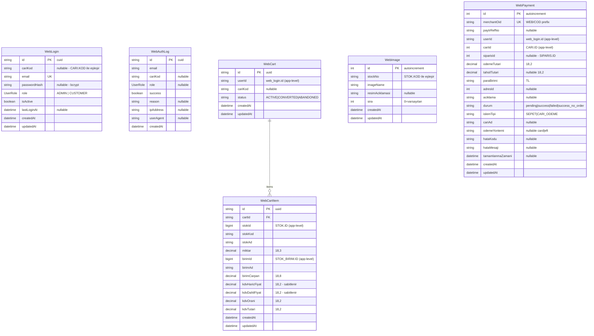

# Entity-Relationship Diyagramı

Bu diyagram yalnızca **PostgreSQL (web_*)** tablolarını gösterir. SQL Server (ERP) tabloları dışsal kaynak olup bu diyagramda yer almaz; bağlantılar uygulama düzeyinde sağlanır.

---

## Mermaid ER Diyagramı



---

## SQL Server (ERP) Tabloları — Referans

Aşağıdaki tablolar SQL Server'da bulunur ve PostgreSQL'e yazılmaz. Uygulama bu tablolardan sadece okur; sipariş oluştururken stored procedure'ler aracılığıyla yazar.

| Tablo | Açıklama | Erişim |
|-------|----------|--------|
| `CARI` | Müşteri kayıtları | Read-only |
| `CARI_BAKIYELER` | Müşteri bakiyeleri (multi-currency) | Read-only |
| `CARI_ADRES` | Müşteri adresleri | Read-only |
| `STOK` | Ürün master | Read-only |
| `STOK_GRUP` | Ürün kategorileri (hiyerarşik) | Read-only |
| `STOK_STOK_BIRIM` | Ürün-birim ilişkisi | Read-only |
| `STOK_BIRIM` | Birim tanımları | Read-only |
| `AS_STOK_MIKTAR_GENEL` | Stok miktarları | Read-only |
| `SIPARIS` | Sipariş başlık | Read via proc |
| `SIPARIS_DETAY` | Sipariş kalemleri | Read via proc |
| `FIS` | Fatura başlık | Read-only |
| `FIS_DETAY` | Fatura kalemleri | Read-only |
| `FINANS` | Finansal hareketler | Read-only |
| `KART_ADLARI` | Muhasebe kart isimleri | Read-only |

---

## Uygulama Düzeyinde Bağlantılar

PostgreSQL ↔ SQL Server bağlantıları DB-level FK olmadan uygulama kodu ile sağlanır:

```
WebLogin.cariKod  ──► CARI.KOD
WebCart.userId    ──► WebLogin.id
WebCartItem.stokId ──► STOK.ID
WebCartItem.birimId ──► STOK_BIRIM.ID
WebPayment.userId ──► WebLogin.id
WebPayment.cariId ──► CARI.ID
WebPayment.siparisId ──► SIPARIS.ID (callback sonrası)
WebImage.stockNo  ──► STOK.KOD
```
