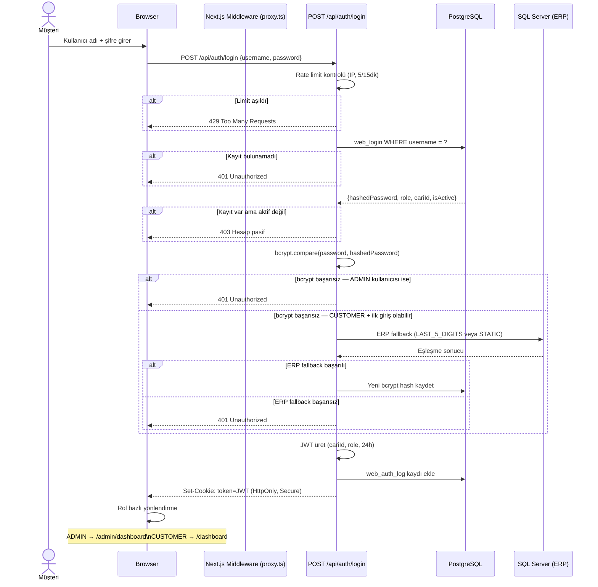
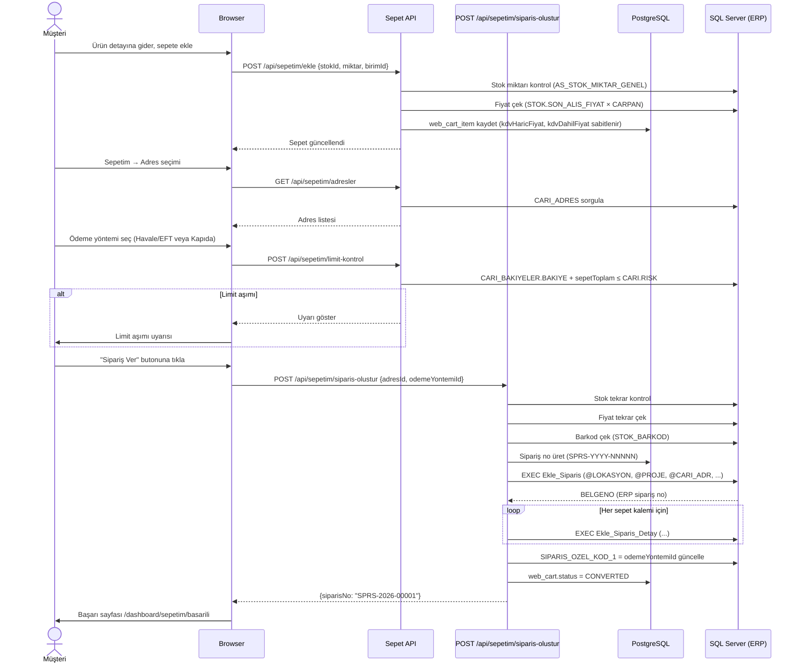
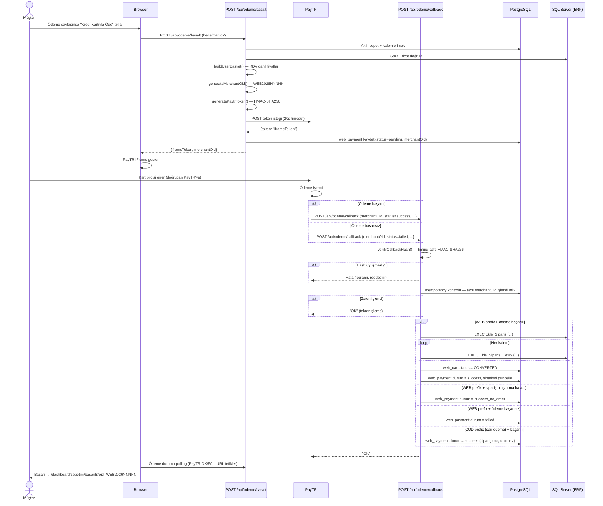

# Sequence Diyagramları

**Versiyon:** 1.0.0 | **Son Güncelleme:** 2026-05-20

---

## 1. Login Akışı (Cari — Hibrit Kimlik Doğrulama)

---

## 2. Sepet → Sipariş Oluşturma Akışı (Havale/EFT veya Kapıda Ödeme)

---

## 3. PayTR Kredi Kartı Ödeme Callback Akışı

