# Use Case Diyagramı

**Versiyon:** 1.0.0 | **Son Güncelleme:** 2026-05-20

---

## 1. Kullanım Senaryoları — Tüm Roller

```mermaid
graph TB
    subgraph Sistem["B2B ERP Portali"]
        direction TB

        subgraph Auth["Kimlik Doğrulama"]
            UC1[Giriş Yap]
            UC2[Çıkış Yap]
        end

        subgraph Profil["Profil"]
            UC3[Profil Bilgisi Görüntüle]
        end

        subgraph Stok["Stok / Ürün Kataloğu"]
            UC4[Ürün Listesini Görüntüle]
            UC5[Ürün Ara / Filtrele]
            UC6[Ürün Detayı Görüntüle]
            UC7[Sepete Ürün Ekle]
        end

        subgraph Sepet["Sepet"]
            UC8[Sepeti Görüntüle]
            UC9[Ürün Miktarı Güncelle]
            UC10[Ürün Sepetten Sil]
            UC11[Adres Seç]
            UC12[Ödeme Yöntemi Seç]
            UC13[Sipariş Ver - Direkt]
            UC14[Kredi Kartıyla Öde - PayTR]
        end

        subgraph Siparis["Siparişler"]
            UC15[Sipariş Listesini Görüntüle]
            UC16[Sipariş Detayı Görüntüle]
        end

        subgraph Hareketler["Finansal Hareketler"]
            UC17[Hareket Listesini Görüntüle]
            UC18[Hareket Detayı Görüntüle]
            UC19[Hareketleri Dışa Aktar - PDF/Excel]
        end

        subgraph Odeme["Ödeme"]
            UC20[Cari Borç Öde - Direkt PayTR]
            UC21[Ödeme Geçmişi Görüntüle]
        end

        subgraph AdminOnly["Yalnızca Admin"]
            UC22[Cari Listesini Görüntüle]
            UC23[Cari Detayı Görüntüle]
            UC24[Cari Şifre Sıfırla]
            UC25[Cari Aktif/Pasif Yap]
            UC26[Ürün Görseli Yükle/Sil/Sırala]
            UC27[Müşteri Adına İşlem Yap]
            UC28[Döviz Kuru Ayarla]
            UC29[Tüm Ödemeleri Görüntüle]
        end
    end

    CUSTOMER([👤 Müşteri\nCUSTOMER])
    ADMIN([🔑 Admin\nADMIN])

    CUSTOMER --> UC1
    CUSTOMER --> UC2
    CUSTOMER --> UC3
    CUSTOMER --> UC4
    CUSTOMER --> UC5
    CUSTOMER --> UC6
    CUSTOMER --> UC7
    CUSTOMER --> UC8
    CUSTOMER --> UC9
    CUSTOMER --> UC10
    CUSTOMER --> UC11
    CUSTOMER --> UC12
    CUSTOMER --> UC13
    CUSTOMER --> UC14
    CUSTOMER --> UC15
    CUSTOMER --> UC16
    CUSTOMER --> UC17
    CUSTOMER --> UC18
    CUSTOMER --> UC19
    CUSTOMER --> UC20
    CUSTOMER --> UC21

    ADMIN --> UC1
    ADMIN --> UC2
    ADMIN --> UC4
    ADMIN --> UC5
    ADMIN --> UC6
    ADMIN --> UC8
    ADMIN --> UC11
    ADMIN --> UC12
    ADMIN --> UC13
    ADMIN --> UC14
    ADMIN --> UC15
    ADMIN --> UC16
    ADMIN --> UC17
    ADMIN --> UC18
    ADMIN --> UC19
    ADMIN --> UC21
    ADMIN --> UC22
    ADMIN --> UC23
    ADMIN --> UC24
    ADMIN --> UC25
    ADMIN --> UC26
    ADMIN --> UC27
    ADMIN --> UC28
    ADMIN --> UC29
```

---

## 2. Erişim Matrisi

| İşlev | CUSTOMER | ADMIN | Not |
|-------|----------|-------|-----|
| Giriş / Çıkış | ✅ | ✅ | — |
| Profil görüntüle | ✅ (kendi) | — | Salt okunur |
| Ürün listesi / detay | ✅ (AKTIF) | ✅ (tümü) | Admin pasif ürünleri de görür |
| Fiyat detayı (maliyet, marjin) | ❌ | ✅ | Müşteriye sadece nihai fiyat |
| Sepet işlemleri | ✅ (kendi) | ✅ (`hedefCariId` ile) | Admin müşteri adına işlem yapabilir |
| Sipariş listesi | ✅ (kendi) | ✅ (tümü) | — |
| Sipariş oluşturma | ✅ | ✅ | — |
| Finansal hareketler | ✅ (kendi) | ✅ (tümü) | — |
| Hareket dışa aktar | ✅ | ✅ | — |
| Cari ödeme (direkt borç) | ✅ (feature flag) | ✅ | `enableDirectDebtPayment` |
| Ödeme geçmişi | ✅ (kendi) | ✅ (tümü) | — |
| Cari yönetimi | ❌ | ✅ | — |
| Görsel yönetimi | ❌ | ✅ | — |
| Döviz kuru ayarı | ❌ | ✅ | — |

---

## 3. Kısıtlamalar ve İş Kuralları

- Müşteri başka bir müşterinin siparişine, hareketlerine veya sepetine erişemez (HTTP 403)
- Admin tüm carilere erişebilir; `hedefCariId` parametresiyle müşteri adına işlem yapabilir
- Stokta olmayan veya kritik eşikin altındaki ürünler müşteri tarafından sepete eklenemez
- Limit aşımı durumunda havale/EFT/kapıda ödeme bloke edilir; kredi kartı limiti bypass eder (ödeme zaten alındı)
- PayTR callback endpoint'i (`/api/odeme/callback`) auth middleware dışındadır — public
- `enableDirectDebtPayment = false` ise cari ödeme menüleri ve endpoint'i devre dışıdır
